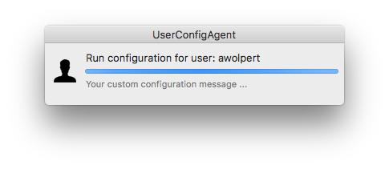

# UserConfigAgent
---
is a simple macOS UserAgent App, that checks for configuration files and processes the given actions. Normally run a script to configure an App in different "TargetAppState" stages. E.g. if an App is closed or launched. A configuration "Repeat" mode can be set to run once, always or never. Optional, a UI with a custom configuration message can be presented.

## Testing
UserConfigAgent has had very little testing so far but has been known to
work on 10.12, 10.11.6.

There's no real reason it shouldn't work on 10.10 and 10.9, it just hasn't been tried. If you find it works, please let us know!

## Screenshots



## Installation

### Prerequisites
1. The Luggage
	- to install _the luggage_ run the following commands from your command line with an administrator account:

	```
	git clone https://github.com/unixorn/luggage.git
	cd luggage
	sudo make bootstrap_files
	```
2. Xcode
	- to install _Xcode_ go to the App Store and download the Xcode app.

3. Open Xcode to accept the license agreement or run the follings command. Follow the instructions on the screens.
	- ```xcodebuild -license```

4. Xcode command line tools: Run the following command to download and install Xcode command line tools. Follow the instructions on the screen.
	- ```xcode-select --install```

5. CocoaPods
	- to install _CocoaPods_ run the following command from your command line with an administrator account:

	```sudo gem install cocoapods```


### Make the installer package for UserConfigAgent

There's a package Makefile in the Package folder.  
To make the installer package simply run the following commands with an administrator account:  
```
cd <where ever the project is>/Package
make pkg
```

You will be prompted to enter the password for the administrator account you are running this command from. The first time you run the command it will take a longer time to download and install some additional _CocoaPods_-requirements.


The package will install UserConfigAgent so that it works at the LoginWindow and Screensaver.
In order to do enable Screensaver functionallity, it has to:

1. Restore the screensaver login UI to an older-looking UI. SecurityAgentPlugins
    do not run under the newer loginwindow-like UI.
2. Set the screensaver login policy to `authenticate-session-owner`.

Optional: 

You can change the path to the configuration files:

	defaults write /Library/Preferences/com.macdevteam.UserConfigAgentGUIAgent.plist PathToConfigFiles YOUR_PATH

You can exclude users to run UserConfigAgent:

	defaults write /Library/Preferences/com.macdevteam.UserConfigAgentGUIAgent.plist BlackListUser -array "root" "ladmin" "jnucadmin"

	

## Uninstallation

	sudo /Library/Security/SecurityAgentPlugins/UserConfigAgentPlugin.bundle/Contents/Resources/uninstall.sh

## How it works

During every login the plugin is invoked. It does the following:

1. Check that the right being authenticated is either system.login.screensaver
   or system.preferences.\*
2. Retrieve the username and password currently being authenticated
3. If both are true, transfers the username password to *"UserConfigAgentXPCAgent"* via NSXPCConnection
3. A trigger file is touched so that launchd can proceed with *"UserConfigAgentGUIAgent"* after login


After Login

1. Get password from *"UserConfigAgentXPCAgent"* via NSXPCConnection
2. Eval configuration files
3. Run configuration scripts

The user password can be passed to the configuration scripts via stdin. Therefore you need to define the *"ProvidePassword"* key in your configuration file. (see Usage)


## Usage

### Example configuration files

#### Basic minimal example
	<?xml version="1.0" encoding="UTF-8"?>
	<!DOCTYPE plist PUBLIC "-//Apple//DTD PLIST 1.0//EN" "http://www.apple.com/DTDs/PropertyList-1.0.dtd">
	<plist version="1.0">
	<dict>
        <key>ScriptPath</key>
        <string>/Library/Application Support/UserConfigAgent/ScriptFiles/configure_just_run_a_script.sh</string>
        <key>Repeat</key>
        <string>once</string>
	</dict>
	</plist>


#### TargetAppState = closed
	<?xml version="1.0" encoding="UTF-8"?>
	<!DOCTYPE plist PUBLIC "-//Apple//DTD PLIST 1.0//EN" "http://www.apple.com/DTDs/PropertyList-1.0.dtd">
	<plist version="1.0">
	<dict>
        <key>TargetAppState</key>
        <string>closed</string>
        <key>TargetApp</key>
        <string>com.microsoft.Outlook</string>
        <key>ScriptPath</key>
        <string>/Library/Application Support/UserConfigAgent/ScriptFiles/configure_outlook.sh</string>
        <key>Repeat</key>
        <string>once</string>
        <key>VisualizeMsg</key>
        <string>Configure MS Outlook ...</string>
        <key>ProvidePassword</key>
        <true/>
	</dict>
	</plist>


#### TargetAppState = launched
	<?xml version="1.0" encoding="UTF-8"?>
	<!DOCTYPE plist PUBLIC "-//Apple//DTD PLIST 1.0//EN" "http://www.apple.com/DTDs/PropertyList-1.0.dtd">
	<plist version="1.0">
	<dict>
        <key>TargetAppState</key>
        <string>launched</string>
        <key>TargetApp</key>
        <string>com.microsoft.Outlook</string>
        <key>ScriptPath</key>
        <string>/Library/Application Support/UserConfigAgent/ScriptFiles/configure_verify_contacts_outlook.sh</string>
        <key>Repeat</key>
        <string>always</string>
        <key>VisualizeMsg</key>
        <string>Verify Service Contacts ...</string>
        <key>ProvidePassword</key>
        <false/>
	</dict>
	</plist>


### Key Description

#### Required Keys

**ScriptPath** = Path to the script to run  
Hint: see the configuration example to handle the path correctly!  

	<key>ScriptPath</key>
	<string>/Library/Application Support/UserConfigAgent/ScriptFiles/...</string>

**Repeat** = once; always; never

	<key>Repeat</key>
	<string>always</string>
 


#### Optional Keys

You can use the key *"TargetApp"* to configure an App by a BundleIdentifier.  

**TargetApp** = BundleIdentifier of an App that should be configured

	<key>TargetApp</key>
	<string>com.microsoft.Outlook</string>


**[REQUIRED when TargetApp is set]**  

**TargetAppState** = The App State where the App should be configured  
Modes: closed; launched
	
	<key>TargetAppState</key>
	<string>closed</string>


**VisualizeMsg** = Display a configuration message  
Modes: "Some custom configuration message"

	<key>VisualizeMsg</key>
	<string>Some custom configuration message</string>


**ProvidePassword** = Provide the user password in configuration script
Modes: true; false  
	
	<key>ProvidePassword</key>
	<false/>


***
### Script Environment

*"UserConfigAgentGUIAgent"* passes custom environment variables to the configuration scripts. More a legacy feature, but maybe someone will find it useful.
	
	"MY_FIRSTNAME" = "Apple"
    "MY_FULLNAME" = "Apple Seed"
    "MY_GUID" = 20
    "MY_LASTNAME" = "Seed"
    "MY_REALNAME" = "Apple Seed"
    "MY_SHORTNAME" = "aseed"
    "MY_UID" = 501


***	